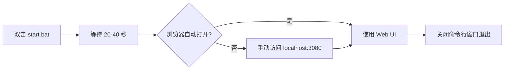

# DeepSeek Harness (dsh) 便携版

> **免安装 · 双击即用 · 本地 AI 对话工具**
>
> 基于 DeepSeek 官方 Cordis 插件系统构建，已内置 Node.js 运行时，无需在电脑上安装任何软件。

[](LICENSE)


---

## 目录

- [项目简介](#项目简介)
- [系统要求](#系统要求)
- [快速开始](#快速开始)
- [文件结构详解](#文件结构详解)
- [架构说明](#架构说明)
- [使用指南](#使用指南)
- [配置与自定义](#配置与自定义)
- [FAQ / 常见问题](#faq--常见问题)
- [给开发者的说明](#给开发者的说明)

---

## 项目简介

DeepSeek Harness（简称 **dsh**）是 DeepSeek 官方推出的本地 AI 对话客户端，采用 **Cordis 插件架构**，模块化程度高、扩展性强。

本版本为 **Windows 便携版**，特点：

- **💼 免安装** — 已内置 Node.js 22，双击 `start.bat` 即可运行
- **📦 绿色便携** — 所有数据保存在 `data/` 目录，可整目录拷贝迁移
- **🔌 插件化架构** — 基于 Cordis 框架，可自由组合插件
- **🌐 浏览器界面** — 启动后通过 `http://127.0.0.1:3080` 访问 Web UI
- **🎨 动态视频壁纸** — 按 V 键切换动态/静态背景
- **🤖 多模型支持** — 支持 DeepSeek 及 OpenAI 兼容 API

---

## 系统要求

| 项目 | 要求 |
|------|------|
| 操作系统 | Windows 10 / 11 **64 位（x64）** |
| CPU 架构 | **x64**（不支持 ARM，如骁龙笔记本） |
| 内存 | 最低 4GB，推荐 8GB+ |
| 联网 | 需要联网调用 AI API |
| 管理员权限 | **不需要** |
| 预装软件 | **不需要**（已内置 Node.js） |

---

## 快速开始

### 1️⃣ 下载并解压

从本仓库的 [Releases](https://github.com/ZhangJie86889/DeepSeekHarness/releases) 页面下载 `DeepSeekHarness_便携版.zip`，或直接从仓库根目录下载该 ZIP 文件。

> ⚠️ **重要：请使用 7-Zip / Bandizip / WinRAR 解压**，不要用 Windows 自带的压缩工具，否则 node_modules 中的长路径会解压失败。

### 2️⃣ 双击启动

找到解压后的文件夹，双击 **`start.bat`**，等待约 20-40 秒即可。

### 3️⃣ 打开浏览器

程序会自动打开 `http://127.0.0.1:3080`（若未自动打开请手动访问）。

### 4️⃣ 配置 API Key

在页面设置中填入你的 **DeepSeek API Key**（或其他 OpenAI 兼容端点 Key），保存后即可开始对话。

---

## 文件结构详解

```
DeepSeekHarness_便携版/
│
├── start.bat                    ← 🚀 启动器（唯一需要操作的文件）
├── README.txt                   ← 原版快速说明
├── package.json                 ← 项目元数据与依赖声明
├── package-lock.json            ← 依赖锁定文件
│
├── node/                        ← 📦 内置 Node.js 22 运行时（x64）
│   └── node.exe                 ←    约 85MB，纯绿色免安装
│
├── node_modules/                ← 📚 npm 依赖库（~512 个包）
│   └── @deepseek-ai/
│       ├── dsh/                 ←    Core：Harness 核心
│       │   └── lib/bin.js       ←    入口文件，start.bat 调用此文件
│       ├── dsh-base/            ←    基础插件包
│       ├── dsh-web-app/         ←    Web UI 插件包
│       ├── dsh-shell/           ←    Shell 命令执行
│       ├── dsh-fs/              ←    文件系统操作
│       ├── dsh-sandbox/         ←    安全沙箱
│       ├── dsh-code-runtime/    ←    代码执行运行时
│       ├── dsh-workflow/        ←    工作流引擎
│       ├── dsh-bash-local/      ←    本地 Bash 执行
│       ├── dsh-subprocess/      ←    子进程管理
│       ├── dsh-timeout/         ←    超时控制
│       ├── dsh-compaction/      ←    对话压缩
│       ├── dsh-output-retention/←    输出保留策略
│       ├── dsh-session-telemetry/  ← 会话遥测
│       ├── dsh-session-title-llm/  ← AI 生成会话标题
│       ├── dsh-scope/           ←    作用域管理
│       ├── dsh-invariants/      ←    不变性检查
│       ├── dsh-spill/           ←    溢出处理
│       ├── dsh-subagent-in-process-driver/ ← 子代理进程驱动
│       └── cordis-plugin-group/ ←    插件分组管理
│
└── data/                        ← ⚙️ 用户数据目录（可迁移）
    ├── settings.yaml            ←    用户设置（模型、主题等）
    ├── .credentials.yaml        ←    🔑 API Key 存储（已通过 .gitignore 排除）
    │
    ├── profiles/                ←    🎯 配置文件（Profile）
    │   └── web/                 ←        Web 模式 profile
    │       ├── package.json     ←        profile 依赖声明
    │       ├── pnpm-workspace.yaml  ←  pnpm 工作区设置
    │       ├── cordis.yml       ←        插件加载列表（只读模板）
    │       ├── cordis.patch.yml ←        ✏️ 用户插件补丁配置
    │       └── node_modules/    ←        profile 级前端插件
    │           └── dsh-client-chat-background/  ← 聊天背景插件
    │
    └── storages/                ←    💾 持久化存储
        └── workspace.json       ←        工作区数据
```

---

## 架构说明

### 整体架构

```
┌─────────────────────────────────────────────────────────┐
│                   用户操作层面                            │
│  双击 start.bat  →  命令行窗口  →  浏览器打开 UI        │
└──────────────────────┬──────────────────────────────────┘
                       │
┌──────────────────────▼──────────────────────────────────┐
│             启动流程                                      │
│  start.bat                                               │
│    ↓                                                     │
│  查找 node.exe（内置 → PATH → 系统安装目录）             │
│    ↓                                                     │
│  设置 DSH_HOME = data/ 目录                              │
│    ↓                                                     │
│  执行 node node_modules/@deepseek-ai/dsh/lib/bin.js web  │
│    ↓                                                     │
│  Cordis 框架加载 Web Profile 配置文件                    │
│    ↓                                                     │
│  启动 HTTP 服务 → http://127.0.0.1:3080                  │
└──────────────────────────────────────────────────────────┘
```

### 技术栈

| 层级 | 技术 |
|------|------|
| **运行时** | Node.js 22（便携版） |
| **框架** | [Cordis](https://github.com/cordiverse/cordis) — 插件化 IoC 容器 |
| **前端** | Web UI（内置在 @deepseek-ai/dsh-web-app 中） |
| **语言** | JavaScript (ESM) |
| **包管理** | npm / pnpm |

### Cordis 插件系统

本项目的核心是 **Cordis 插件架构**。简单来说，每一块功能都是一个独立的插件：

- **基础插件**（`dsh-base`）— 核心功能、会话管理、消息路由
- **Web 应用插件**（`dsh-web-app`）— 提供浏览器界面
- **工具插件** — Shell、文件系统、代码运行、沙箱等
- **生命周期插件** — 压缩、超时、输出保留、遥测等插件控制会话行为

这些插件的组合由 **Profile（配置文件）** 决定。当前使用 `data/profiles/web/` 目录下的一组 YAML 配置文件，定义了 Web 模式加载哪些插件及它们的配置。

---

## 界面预览

> 📸 *下方为界面 ASCII 示意图。建议您运行后亲自体验实际界面效果。*

### 主聊天界面

启动后，浏览器将显示如下布局：

```
┌────────────────────────────────────────────────────────────────┐
│  DeepSeek Harness                        设置  ├─ ▼ ─┤  ×  │
├────────────────────────────────────────────────────────────────┤
│                                                                │
│  ┌─ 模型: deepseek-v4-flash ──────────────────────────────┐   │
│  │                        ⚡                                │   │
│  │  ┌──────────────────────────────────────────────────┐   │   │
│  │  │  欢迎使用 DeepSeek Harness                        │   │   │
│  │  │  在下方输入你的问题开始对话                        │   │   │
│  │  └──────────────────────────────────────────────────┘   │   │
│  │                                                        │   │
│  │                                                        │   │
│  │                                                        │   │
│  │                                                        │   │
│  │   ┌──────────────────────────────────────────────────┐  │   │
│  │   │ 输入消息...                     [发送] [附加]    │  │   │
│  │   └──────────────────────────────────────────────────┘  │   │
│  └─────────────────────────────────────────────────────────┘   │
│                                                                │
│  状态: 已连接         使用 Token: 0     模型: v4-flash         │
├────────────────────────────────────────────────────────────────┤
│  按 V 切换背景  |  Ctrl+Enter 换行  |  上箭头编辑上条消息     │
└────────────────────────────────────────────────────────────────┘
```

### 命令行启动窗口

双击 `start.bat` 后，命令行窗口显示如下：

```
============================================================
  DeepSeek Harness is starting...
  First load takes ~20-40 seconds. Please wait, do NOT close this window.
  Your browser will open automatically at: http://127.0.0.1:3080
  (If it does not, just open that address manually.)
  To stop: close this window or press Ctrl+C
============================================================
```

---

## 使用指南

### 启动与关闭



- **启动**：双击 `start.bat`，保持黑色命令行窗口开启
- **访问**：浏览器打开 `http://127.0.0.1:3080`
- **关闭**：关闭命令行窗口，或按 `Ctrl + C`

### 命令行参数

`start.bat` 支持直接传递参数给 dsh：

```bash
start.bat              # 启动 Web UI（默认）
start.bat --help       # 查看所有命令
start.bat headless     # 无界面模式
```

### 对话功能

- **发送消息**：在输入框输入后按回车
- **切换背景**：按键盘 **`V`** 键，在动态壁纸 / 静态背景之间切换
- **多轮对话**：自动保存上下文

### 模型配置

支持多种 AI 模型提供商：

1. 进入 Web UI 的「设置」页面
2. 在「模型」设置中配置：
   - **DeepSeek 官方 API**：填入 DeepSeek API Key，选择模型
   - **OpenAI 兼容 API**：填入自定义端点 URL 和 API Key
3. 保存后即可使用

---

## 配置与自定义

### settings.yaml — 用户偏好设置

`data/settings.yaml` 控制用户的个性化设置：

```yaml
ui-onboarding:
  welcomeNoticeVersion: 2026-08-13.1   # 欢迎页版本（用于更新检测）
  
ui-theme:
  preference: light                     # 主题：light / dark

agent-default-model:
  provider: deepseek-official           # 默认模型提供商
  model: deepseek-v4-flash             # 默认模型
  reasoningEffort: off                  # 推理强度：off / low / medium / high
```

### cordis.patch.yml — 插件扩展点

这是**主要自定义入口**，位于 `data/profiles/web/cordis.patch.yml`。可以通过编辑此文件来：

#### 启用聊天背景
```yaml
- insert:
    - id: chat-background
      name: 'dsh-client-chat-background'
```

#### 启用定时任务/提醒
```yaml
- insert:
    - id: schedule
      name: '@deepseek-ai/dsh-schedule'
```

#### 启用 MCP 客户端（需配置）
```yaml
- insert:
    - id: mcp-client
      name: '@deepseek-ai/dsh-mcp-client'
      config:
        transport: stdio
        serverName: my-server
        command: npx
        args: ['-y', '@modelcontextprotocol/server-filesystem', 'D:/Desktop']
        toolCallTimeoutMs: 60000
```

> ⚠️ MCP 客户端需要正确配置 server 才能启用，否则会导致插件加载失败。

### 恢复出厂设置

关闭程序后，删除 `data/` 目录下的 `storages` 等文件夹即可清空聊天记录和壁纸设置。

---

## FAQ / 常见问题

### Q1：启动时报错 `EADDRINUSE 127.0.0.1:3080`？

上一次没有正常关闭，端口仍被占用。解决方法：
1. 关闭之前的命令行窗口
2. 或在任务管理器中结束占用 3080 端口的进程
3. 重新双击 `start.bat`

### Q2：解压后程序打不开？

几乎都是因为 **Windows 自带解压工具导致的长路径问题**。请用 **7-Zip** 重新解压一次。

### Q3：杀毒软件报毒？

本工具为纯绿色软件，不写注册表、不安装系统服务。若杀毒软件误报，将解压后的文件夹加入白名单即可。

### Q4：什么是 cordis.patch.yml？

这是 Cordis 插件框架的**补丁层**。您可以在其中插入新插件、调整配置，而无需修改底层的只读模板文件（cordis.yml）。

### Q5：ARM 笔记本能运行吗？

**不支持**。本便携版依赖 x64 编译的原生 Node.js 模块，ARM 设备（如骁龙笔记本、Surface Pro X）无法运行。

### Q6：如何备份我的聊天记录？

所有个人数据都在 `data/` 目录内，直接复制备份整个文件夹即可。恢复时将备份的 `data/` 目录覆盖回去。

---

## 给开发者的说明

### 项目初始化方式

原始安装方式（供参考）：

```bash
# 使用 NPMMirror 镜像（国内提速）
npm install --registry https://registry.npmmirror.com
```

### 调试模式

```bash
# 查看详细日志
start.bat --verbose

# 或直接调用 Node
node node_modules/@deepseek-ai/dsh/lib/bin.js web --verbose
```

### Profile 开发

创建新的 Profile 来定制不同的启动配置：

1. 在 `data/profiles/` 下创建新目录，如 `data/profiles/custom/`
2. 新建 `package.json` 声明依赖的 bundles
3. 新建 `cordis.yml` 配置插件列表
4. 通过 `start.bat --profile custom` 启动

### 插件开发

每个插件是一个标准的 npm 包，需遵循 Cordis 插件规范：

```javascript
// 一个简单的 Cordis 插件示例
export const name = 'my-plugin';
export const inject = [];   // 声明依赖的其他插件

export function apply(ctx) {
  // ctx 是插件上下文，可以监听事件、注册服务
  ctx.on('message', (session) => {
    console.log('收到消息:', session.content);
  });
}
```

---

## 许可

本项目基于 [ISC License](LICENSE) 开源。内置的 `@deepseek-ai/*` 系列包版权归 DeepSeek 所有。

---

> **提示**：如有其他问题，请联系您的服务提供方或在 GitHub 上提交 Issue。